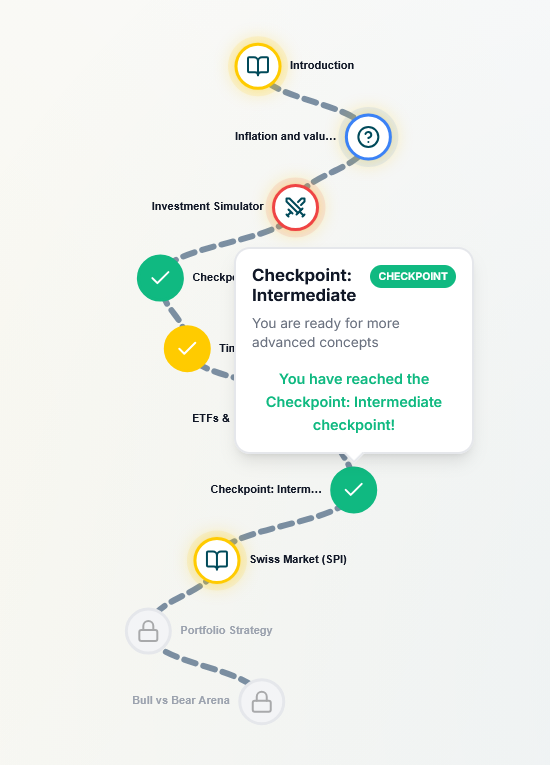
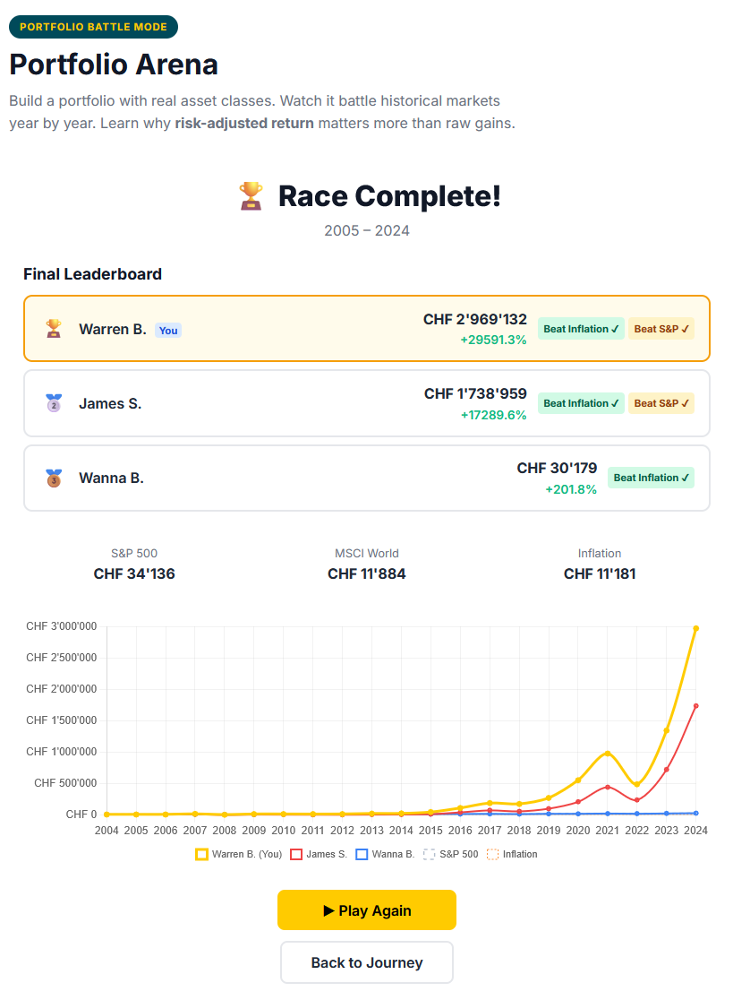
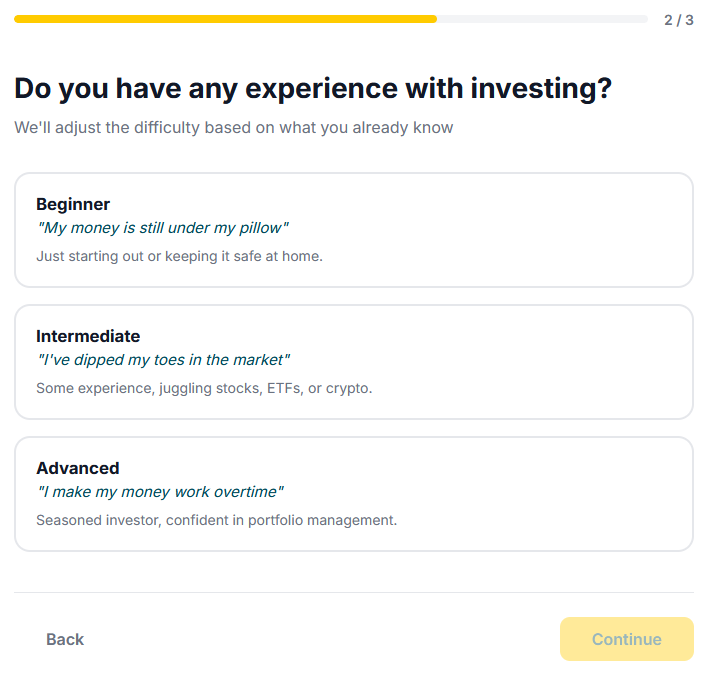
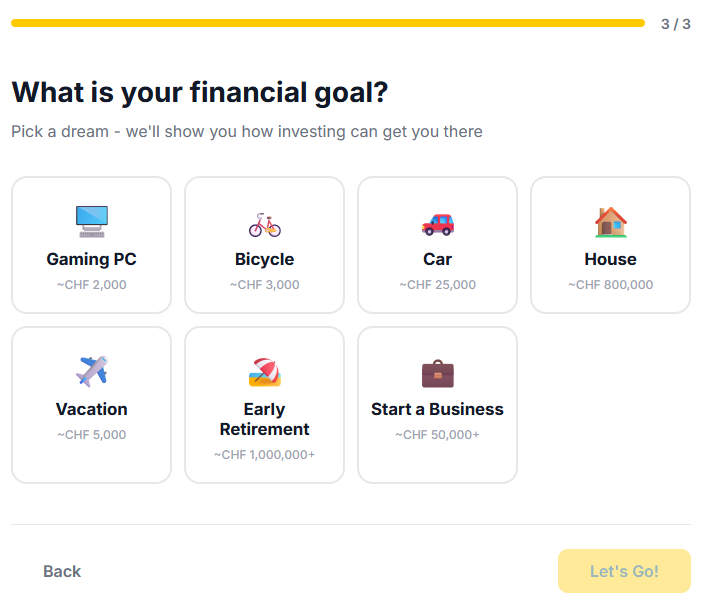
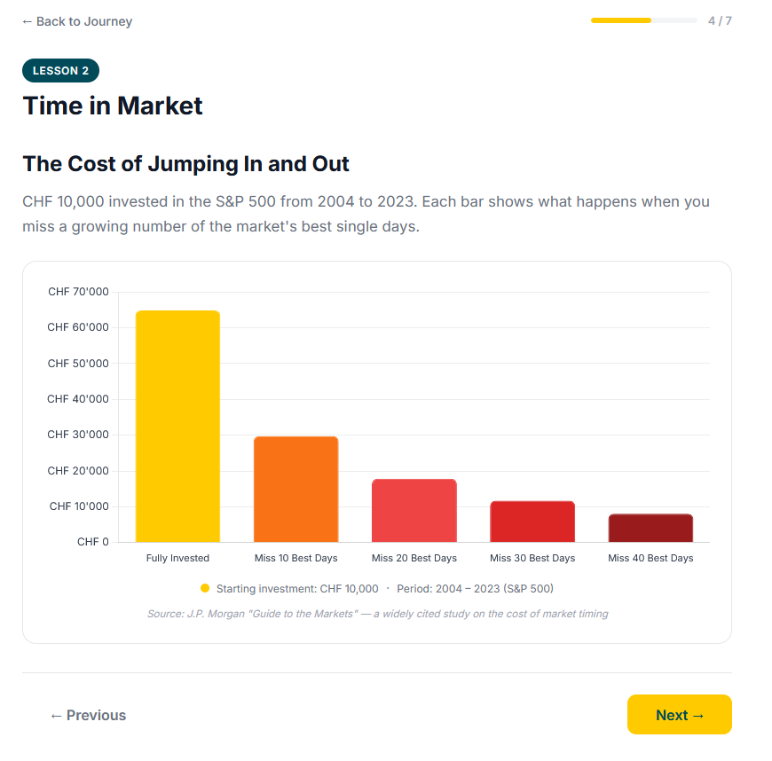

# The Wealthy Way
### *The Duolingo of Financial Literacy*

**[investmentgame.de](https://investmentgame.de)** — Built at [START Hack 2026](https://starthack.eu)


---

 

---

## What It Is

A gamified financial education platform that takes anyone from *"what is inflation?"* to *"how do I build a risk-adjusted portfolio?"* — through story-driven lessons, interactive quizzes, and a real portfolio battle backed by 20 years of actual market data.

Financial literacy is absent from most school curricula. We built the app we wish we'd had at 12 — real data, no real money, zero risk.

---

## Features

| | Feature | Details |
|---|---|---|
| 🐂 | **Barry the Bull** | Personalized onboarding — age, experience level, and savings goal unlock a tailored learning path |
| 🗺️ | **Finance Journey** | Duolingo-style lesson map with story-driven modules, quizzes, and an investment simulator |
| 📈 | **Portfolio Battle** | Build a portfolio from 50+ real assets and race it against S&P 500, MSCI World, and inflation |
| 🏆 | **Sharpe Ratio mechanic** | Risk-adjusted returns taught as a scoring system — not a footnote |
| 🕹️ | **Multiplayer** | Up to 10 players, shared lobby code, live WebSocket race with real-time leaderboard |
| 📊 | **Real historical data** | 20 years of actual annual returns (Feb 2004 – Aug 2025) across 50+ assets |

 

 

---

## Stack

```
Frontend  Vue 3 · TypeScript · Pinia · Chart.js
Backend   FastAPI · WebSockets · SQLite
Data      7 CSV datasets, Feb 2004 – Aug 2025
Deploy    Static frontend + Docker (backend)
```

---

## Getting Started

```bash
# Frontend
cd frontend && npm install && npm run dev
# → http://localhost:5173

# Backend
cd backend && pip install -r requirements.txt
uvicorn app.main:app --reload --port 8000
```

---

## Team

>  &nbsp; [@LukasPotempa](https://github.com/lukaspotempa)

>  &nbsp; [@MaxWinzek](https://github.com/MaxWinzek)

>  &nbsp; [@Erijl](https://github.com/erijl)

---

*Because your future self deserves better than a savings account.*
